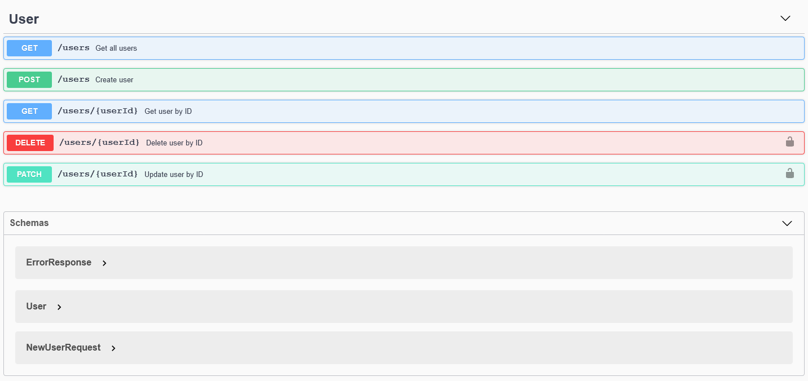

# javalin-openapi-example

## source code for tutorial at [https://javalin.io/tutorials/openapi-example](https://javalin.io/tutorials/openapi-example)

The project contains source roots and main files for Java:

* src: `src/main/java/`, main: `io.javalin.example.java.Main`

## Screenshot

